```mermaid
flowchart TB
  A[Customer API] --> B[Spring Boot 3.x with Java 21]
  A --> C[SQLite + JPA]
  A --> D[REST Controllers]
  A --> E[Dockerized]
  A --> F[Kubernetes Manifests]

  D --> D1[CustomerController]
  D --> D2[IndexController]
  
  C --> C1[CustomerEntity]
  C --> C2[CustomerRepository]
  C --> C3[CustomerService / Impl]

  F --> F1[Deployment YAML]
  F --> F2[Service YAML]
  F --> F3[Ingress ALB]
  F --> F4[IngressClassParams]
  F --> F5[Secrets & ConfigMaps]

  A --> G[Tests]
  G --> G1[Controller Tests]
  G --> G2[Service Tests]
  G --> G3[Model Converter Tests]

  A --> H[HATEOAS Layer]
  H --> H1[CustomerControllerRepresentationModel]

  A --> I[Converters & DTOs]
  I --> I1[CustomerConverter]
  I --> I2[CustomerDto]
  I --> I3[CustomerRequest]
  I --> I4[CustomerResponse]

  A --> J[Resources]
  J --> J1[application.properties]
  J --> J2[persistence.properties]

```

# 🚀 Customer API – Cloud-Native REST Service with Spring Boot & Kubernetes

[](https://www.oracle.com/java/)
[](https://spring.io/projects/spring-boot)
[](https://maven.apache.org/)
[](https://hub.docker.com/)
[](https://kubernetes.io/)
[](LICENSE)

> ✅ A lightweight and production-ready **RESTful microservice** to manage customer records with full **Docker** and **EKS/Kubernetes** deployment support.

---

## 📚 Table of Contents

- [✨ Features](#-features)
- [🚀 Quick Start](#-quick-start)
- [🐳 Docker Support](#-docker-support)
- [☸️ Kubernetes Deployment](#️-kubernetes-deployment)
- [📦 Project Structure](#-project-structure)
- [🤝 Contributing](#-contributing)
- [📄 License](#-license)

---

## ✨ Features

- ⚙️ Built on **Spring Boot 3.x** and **Java 21**
- 💾 Embedded **SQLite** with Spring Data JPA
- 📡 RESTful endpoints with **HATEOAS** support
- 🐳 **Dockerfile** for containerized builds
- ☸️ **Kubernetes manifests** and Ingress (ALB on EKS) for cloud-native deployment
- 📈 Readiness & liveness probes, health check at `/customer-api/healtz`

---

## 🚀 Quick Start

```bash
# Package the application
mvn clean package

# Run the Spring Boot JAR
java -jar target/customer-api-0.0.1-SNAPSHOT.jar
```

Once running, access the API at:

```http
http://localhost:8080/customers
```

---

## 🐳 Docker Support

```bash
# Build the image
docker build -t springboot-api .

# Run the container
docker run -p 8080:8080 springboot-api
```

---

## ☸️ Kubernetes Deployment

All manifests are in the [`infra/k8s`](infra/k8s) folder, including:

- Deployment with probes
- LoadBalancer service or ALB Ingress
- Secrets & config setup

```bash
# Apply the manifests
kubectl apply -f infra/k8s/
```

### 🔥 Ingress via AWS ALB (EKS)

Once deployed to EKS with ALB Ingress:

```bash
curl http://<ALB-DNS>/customer-api/healtz
```

---

## 📦 Project Structure

```
.
├── Dockerfile
├── Dockerfile.bkp
├── README.md
├── assets
│   └── banner.jpg
├── infra
│   └── k8s
│       ├── deployment.yaml
│       ├── ingclass-params.yaml
│       ├── ingclass.yaml
│       ├── ingress.yaml
│       ├── secret.yaml
│       └── service.yaml
├── pom.xml
└── src
    ├── main
    │   ├── java
    │   │   └── org
    │   │       └── armormind
    │   │           └── customerapi
    │   │               ├── CustomerApiApplication.java
    │   │               ├── config
    │   │               │   └── PersistenceConfig.java
    │   │               ├── controller
    │   │               │   ├── CustomerController.java
    │   │               │   └── IndexController.java
    │   │               ├── model
    │   │               │   ├── converter
    │   │               │   │   └── CustomerConverter.java
    │   │               │   ├── dto
    │   │               │   │   └── CustomerDto.java
    │   │               │   ├── entity
    │   │               │   │   └── CustomerEntity.java
    │   │               │   ├── hateoas
    │   │               │   │   └── CustomerControllerRepresentationModel.java
    │   │               │   ├── request
    │   │               │   │   └── CustomerRequest.java
    │   │               │   └── response
    │   │               │       ├── CustomerDeleteResponse.java
    │   │               │       └── CustomerListResponse.java
    │   │               ├── repository
    │   │               │   └── CustomerRepository.java
    │   │               └── service
    │   │                   ├── CustomerService.java
    │   │                   └── impl
    │   │                       └── CustomerServiceImpl.java
    │   └── resources
    │       ├── application.properties
    │       └── persistence.properties
    └── test
        └── java
            └── org
                └── armormind
                    └── customerapi
                        ├── base
                        │   ├── BaseControllerTest.java
                        │   └── BaseServiceTest.java
                        ├── builder
                        │   ├── CustomerMockDataBuilder.java
                        │   └── GenericMockDataBuilder.java
                        ├── controller
                        │   ├── CustomerControllerTest.java
                        │   └── IndexControllerTest.java
                        ├── model
                        │   └── converter
                        │       └── CustomerConverterTest.java
                        └── service
                            └── CustomerServiceTest.java
```



---

## 🤝 Contributing

Found a bug or have a feature request? Feel free to [open an issue](https://github.com/armormind/java-springboot-api/issues) or submit a pull request. Contributions are always welcome.

---

## 📄 License

This project is licensed under the [MIT License](LICENSE.txt).

---